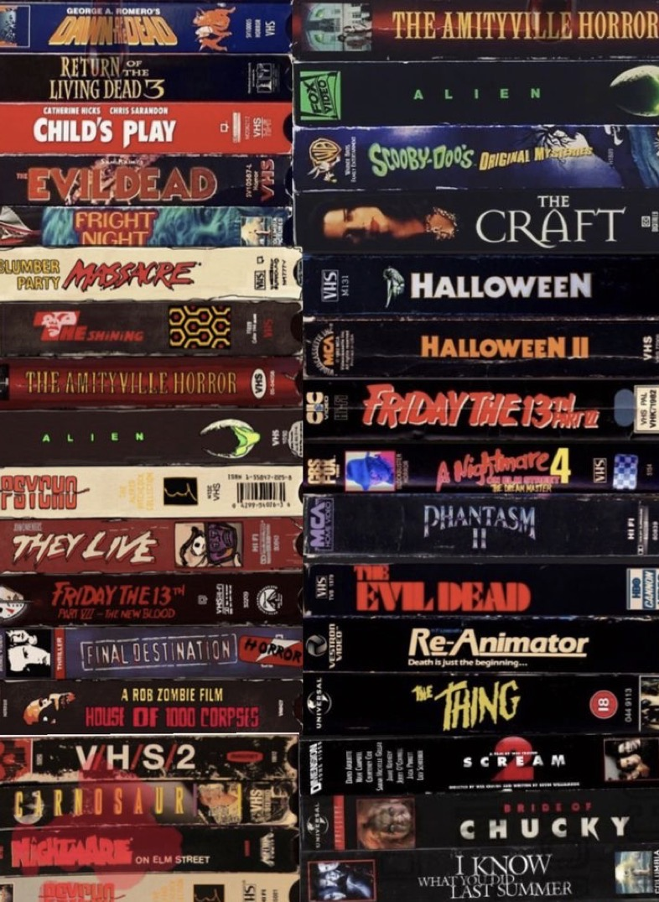

# The Perfect Horror Movie  

[Link to GitHub Repository for this Project]: https://github.com/JessicaLindsey5514/The_Perfect_Horror_Movie.git
[Link to GitHub Repository for this Project]

#### Project Author: Jessica Lindsey

## Purpose  
This project's aim is to find out __what__ makes the Perfect Horror Movie. 

1. __Primary Question/s:__  First we need to determine what is a Perfect Horror Movie, why it is deemed perfect? What factors go into this? 
2. __Secondary Question/s:__  Do the same factors that go into making the perfect horror movie go into making a perfect movie of any genre? Does Horror as a genre get snubbed at the Oscars?

## Sources
#### Horror Movies dataset  
>__Describtion:__ "Purpose is to explore a dataset about horror movies dating back to the 1950s. Data set was extracted from The Movie Datbase via the tmdb API using R httr. There are ~35K movie records in this dataset."

[Horror Movies Dataset]: https://www.kaggle.com/datasets/sujaykapadnis/horror-movies-dataset
[Horror Movies Dataset]
#### Cinatomy: Rating Movies on things that matter.  
>__Describtion:__ "1,000 well-known films (sourced from IMDb's top-rated titles), each scored across 25+ experiential dimensions: ones that users actually care about"

[Cinatomy Dataset]: https://www.kaggle.com/datasets/pomegrenade/cinatomy-experiential-movie-profiles
[Cinatomy Dataset]
#### 9000+ Movies : IMDb and Bechdel  
>__Describtion:__ "This dataset covers information about more than 9000 movies such as their titles, genres, ratings on IMDb and scores to the Bechdel test. It is a test invented in 1985 by Alison Bechdel which consists in the measure of women’s representation in movies. To pass the test, the film must have two women named in it (score 1 to the test, 0 otherwise) who talk to each other (score 2) about anything else than a man (score 3).
The movies' release dates go from 1894 to 2024."

[Bechdel Score Dataset]: https://www.kaggle.com/datasets/nliabzd/movies-imdb-and-bechdel-information
[Bechdel Score Dataset]
#### Oscar Best Picture Movies  
>__Describtion:__ "This data contains the Oscar Best Picture winners and nominees. Additionally, the data contains IMDB and Rotten Tomato ratings."  

[Oscar Best Picture Dataset]: https://www.kaggle.com/datasets/martinmraz07/oscar-movies
[Oscar Best Picture Dataset]

## Getting Started: 
Clone this repository via GitHub:

> git clone https://github.com/JessicaLindsey5514/The_Perfect_Horror_Movie.git

Create and activate a virtual environment
> __Windows:__ .venv\Scripts\active  
> __Mac:__ source .venv/bin/activate

Install the required Python packages
> pip install -r requirements.txt

Open perfect_horror_movie.ipynb
> Run all cells

Deavtivate when Finished
> deactivate

## Project Structure

1. __Data Folder__
    - dataset's csv files
    - database created for SQL queries
    - csv files for tables in database
2. __Notebooks Folder__
    - perfect_horror_movie.ipynb
3. __Visualizations Folder__
    - pngs of plots created in perfect_horror_movie.ipynb
    - ERD (ERD.png)

## Findings  

My first question for this project is what do we need to determine what is a perfect horror movie. My analysis found that a high revenue and high popularity do not necessarily mean a movie is great("perfect", i'll be using great because later you will see perfection isnt easily defined or attainable), but they are good indicators to start with. 
 
I used the cinatomy dataset to check the profiles to look at some of the highest revenue and highest rated horror movies, what they have in common.
As well as looking at the general trends of cinatomy profiles (these are top rated movies so they tend to score positively).

Found these are factors that seem relevant in top rated films: 
- pacing
- performance of actors
- visuals/visual effect
- dialogues
- originality
- impactfulness
- immersiveness

As well as overall feeling, end feeling, and plot quality (which can be effected by the above factors). 

Many of these factors are the same across the board for films of all genres.

My findings were inconclusive as to whether the horror genre gets snubbed at the Oscars, I did not have enough data to make a definitive determination. (check future usage, further analysis would need to be done to make a determination). Though, my analysis did find that Drama is the most prevelant genre amongst Oscar Best Picture winners and nominees. This leads me to believe realism is an important factor in a great movie and audiences feel more of a connection to movies they feel could be possible.

## Future Usage

I set forth to answer a very broad, vague question. Some would could it a fool's errand but it feels more like the spark for a much larger project or group of related projects.  

__Future projects could include:__ 

1. How to Make a Great Movie
My findings lead me to believe that these factors make a great movie in general instead of specifically a movie in the horror genre; do all movies(of any genre) follow the same formula to be great?

2. Women as an Audience
What genres do women feel most connected too? Are there trends in how those genres typically score on the bechdel scale? Has how women are viewed in movies changed? How so? Are there factors that are more important to male vs female audiences. 

3. Collobrative Work with Cinatomy Dataset
Originally I thought adding bechdel scores to the cinatomy datset would be a valuable addition, but with further consideration I think a category on the perception of women in the film would be a better fit. It could be rated on a 1 through 5 scale like a majority of the columns in the cinatomy dataset (1 being a mysognistic view of women to 5 pure misandry). With the rise of the "Good for Her" trope, which has a significant following not just in film but other media, I believe this category would fit the original goal of the cinatomy dataset to simplify matching users to movies that fit the mood they are in.   
I also think breaking up the originality column into two seperate columns: how unique a film's story is and how unique the execution of the story is. For example, Clueless and The Lion King are retellings of Shakespeare plays; their story is not unique but the execution of the story is. 
 
4. How Does Current Political and Economic Issues effect the Film Industry
Are specific tropes more prevelant during historical events? Were there more war movies after 9/11? Did Covid lead to a rise in pandemic movies? How will the rise of AI effect sci-fi (or romance) as a genre?  
Do these trends say something about how our society copes with major historical events?

5. Drama as a genre is an Umbrella Term.  
My findings did point to the drama genre being the main contender for Oscar Best Picture. But is drama an umbrella term that can encompass many other genres? Does realism make audiences feel more connected? Does feeling connected to a movie make it a great movie?  

*Needed for future usage, further analysis: a larger movie dataset like the TMDB API, historical events dataset*

### AI Usage 
- educational enhancement
- AI generated content (cinatomy dataset)
- AI tool usage (code partially wrote by AI for genre unifying function)
